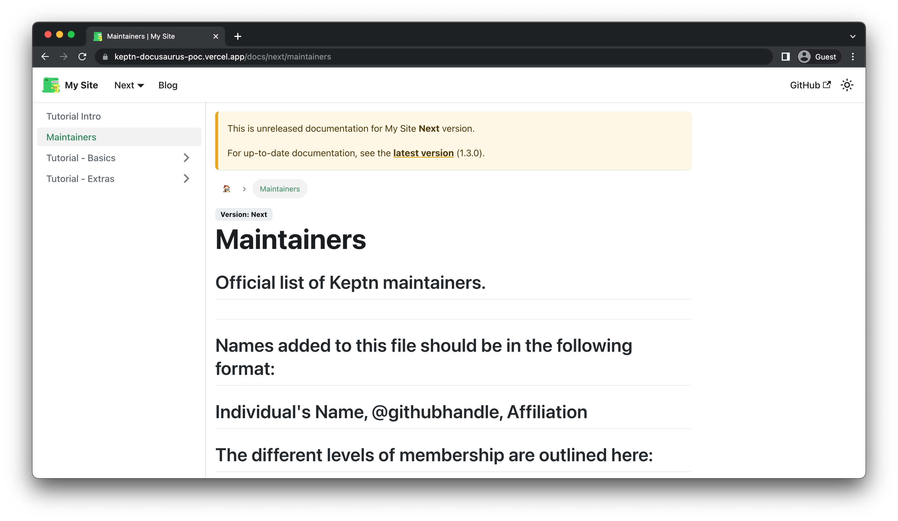

<div align="center">

<br />

<br />
<h1>Keptn</h1>
<h3>
New Documentation Site Engine
<br />
Project Proposal
</h3>
</div>

## Table of Contents

- [About me](#about-me)
  - [Basic Information](#basic-information)
- [Introduction](#introduction)
- [Problem Statement](#problem-statement)
- [Current Status of the Project](#current-status-of-the-project)
- [Project scope & deliverables](#project-scope-&-deliverables)
  - [Expected Deliverables](#expected-deliverables)
  - [Future work based on Project](#future-work-based-on-project)
- [Brief description of my Solution & Implementation](#brief-description-of-my-solution--implementation)
  - [Multiple repository docs support](#multiple-repository-docs-support)
  - [Versioning of docs support](#versioning-of-docs-support)
- [Project Timeline](#project-timeline)
  - [Community Bonding (May 20 - June 12, 2022)](#community-bonding-may-20---june-12-2022)
  - [Development Phase](#development-phase)
    - [Phase 1](#phase-1)
    - [Phase 2](#phase-2)
- [Contributions to Keptn](#contributions-to-keptn)
  - [Issues](#issues)
  - [Pull requests](#pull-requests)
- [Why am I the best person to execute this proposal?](#why-am-i-the-best-person-to-execute-this-proposal)
- [Communication](#communication)
- [Post GSoC](#post-gsoc)

## About me

#### Basic Information

|      Name:      |                                                                 Rajiv Ranjan Singh                                                                 |
| :-------------: | :------------------------------------------------------------------------------------------------------------------------------------------------: |
|     Email:      |                                           [rajivperfect007@gmail.com](mailto:rajivperfect007@gmail.com)                                            |
|     GitHub:     |                                             [https://github.com/iamrajiv](https://github.com/iamrajiv)                                             |
|    LinkedIn:    |                         [https://www.linkedin.com/in/iamrajivranjansingh](https://www.linkedin.com/in/iamrajivranjansingh)                         |
|     Quora:      |                     [https://www.quora.com/profile/Rajiv-Ranjan-Singh-67](https://www.quora.com/profile/Rajiv-Ranjan-Singh-67)                     |
| Stack Overflow: | [https://stackoverflow.com/users/10765954/rajiv-ranjan-singh?tab=profile](https://stackoverflow.com/users/10765954/rajiv-ranjan-singh?tab=profile) |
|    Twitter:     |                                            [https://twitter.com/therajiv](https://twitter.com/therajiv)                                            |

> **Timezone: India Standard Time (UTC+05:30)**

> **Medium-sized project (~175 hours)**

Hello, I am a final year undergraduate student at JSSATE Bengaluru pursuing my Bachelor of Engineering in the Information Science & Engineering department.

I consider myself a Polymath. I believe in rigorous and intuitive learning. Spend the majority of the time exploring different types of algorithms and contributing to open source. My interest lies in the fields of Algorithms, Computational Science, and Distributed Computing.

I am an open-source enthusiast and contributed to and participated in various open-source libraries and programs respectively.

> I did Google Season of Docs 2020 with [gRPC-Gateway](https://github.com/grpc-ecosystem/grpc-gateway), my project was on **Refactoring the Existing Docs Site of gRPC-Gateway**.
> My Google Season of Docs 2020 project repository: [https://github.com/iamrajiv/GSoD-2020](https://github.com/iamrajiv/GSoD-2020).

> I did Google Season of Docs 2021 with [Wechaty](https://github.com/wechaty), my project was on **Improve the gRPC and OpenAPI ecosystem** of Wechaty.
> My Google Season of Docs 2021 project repository: [https://github.com/iamrajiv/GSoD-2021](https://github.com/iamrajiv/GSoD-2021).

> I did Linux Foundation Mentorship 2021 with [moja global](https://github.com/moja-global), my project was on **Cloud native measurement, reporting and validation of carbon emissions**.
> My Linux Foundation Mentorship 2021 project repository: [https://github.com/iamrajiv/lfx-2021](https://github.com/iamrajiv/lfx-2021).

I am proficient in C, C++, Go, JavaScript, Shell Scripting, etc. I have good knowledge of Backend Development and Web Development. I have worked on React and Vue.js. I have also worked on Cloud-native technologies like Docker, Kubernetes, etc.

I have decent experience in competitive programming and hence have a good understanding of various data structures and algorithms. I have a fair experience working alone and solving problems on my own. I also have good experience in Git workflows and community activities like reviewing and testing others' code.

## Introduction

This is the project proposal for the **New Documentation Site Engine** for Keptn on which I want to work as a part of Google Summer of Code 2022. I have proposed my timeline to complete this work in a span of **12 weeks**.

Keptn is an event-driven orchestration engine for cloud-native apps. Started in 2018, it uses a declarative approach to automate delivery and operations so they can be scaled up to a large number of services. Keptn evaluates _Service Level Indicators (SLOs)_ and provides a dashboard, alerts, and auto-remediation for them. It also provides integrations with the Cloud Native ecosystem including _Prometheus_, _ArgoCD_, _CloudEvents_, _Backstage_, and many other cloud-native projects.

## Problem Statement

Making a **New Documentation Site Engine** for Keptn which can handle a large number of documentation projects of Keptn.

**Open Issue:** [https://github.com/keptn/keptn.github.io/issues/994](https://github.com/keptn/keptn.github.io/issues/994)

**Project Idea:** [https://github.com/keptn/community/blob/main/mentorship/gsoc/2022/project-ideas.md#new-documentation-site-engine](https://github.com/keptn/community/blob/main/mentorship/gsoc/2022/project-ideas.md#new-documentation-site-engine)

## Current Status of the Project

Currently, the Keptn documentation site is based on a [Hugo](https://gohugo.io/) theme called [hugo-serif-theme](https://github.com/zerostaticthemes/hugo-serif-theme). For tutorials, [Codelabs](https://github.com/googlecodelabs/tools) is also used. While extremely handy for smaller projects and initial versions of Keptn, this toolchain has serious deficiencies for larger-scale projects like Keptn.

Some issues with the current documentation site of Keptn:

- No document aggregation from multiple repositories. It prevents the community from using the [Documentation as Code](https://www.writethedocs.org/guide/docs-as-code/) approach when documentation is stored and modified along with production code in its repositories.
- No support for versioning, so we do a lot of copy-paste to preserve old versions of the documentation. This also causes issues with external references from other docs that link into the documentation.
- Does not support shared text between different docs.

and many more.

## Project scope & deliverables

The user docs site is designed to assist end-users in using a product or service. The excellent user docs site is significant because it provides an avenue for users to learn how to use the software, its features, tips, and tricks, and resolve common problems encountered when using the software. It also reduces support costs and is part of the corporate identity of the product. The excellent user docs site is a sign of the healthiness of the product, and the developer team. Without a good user docs site, a user may not know how to do the above things effectively and efficiently. User docs site can play a pivotal role in ensuring a product's success because excellent communication is and will always be at the heart of any business or development. Fantastic documentation takes that communication and puts it in a manageable framework that everyone can access for success.

#### Expected Deliverables

- Support for the latest link pointing to the documentation for the last release.
- Use versioned documentation from external sources, ideally from version tags and branches.
- Move documentation sources to code repositories so that we could enable documentation as code and make documentation patches a part of the contribution process.
- Automation that builds the site from multiple repositories. It includes scripting, GitHub Actions, and automated configuration management.
- GitHub workflows for continuous deployment of the website to GitHub Pages, Netlify, Vercel, etc.
- Implement previews for the website and support for staging changes (e.g. pre-release documentation).

and many more.

#### Future work based on Project

After completion of the above deliverables, we can work on the following:

- Improving SEO of versioned docs and the whole documentation site.
- Adding interactive documentation example by rendering JSX in markdown content with the help of MDX support of Docusaurus.
- Adding standalone Pages for a great user experience.
- Improving UI of the documentation site.

and many more.

## Brief description of my Solution & Implementation

I am going to propose a **New Documentation Site Engine** that will be based on [Docusaurus](https://docusaurus.io/). Docusaurus is an optimized site generator in React. Docusaurus helps you to move fast and write content. Build documentation websites, blogs, marketing pages, and more. Also, I have created a doc on a comparison between Antora & Docusaurus [here](https://docs.google.com/document/d/1R5i5Pc3cPLiePkTor__sRg90rXCQdRQBmIGRnm3PlZA/edit?usp=sharing).

**Previous discussions with the Keptn team about the documentation site engine:**

- [https://keptn.slack.com/archives/C033WCZFMAR/p1646775463478699](https://keptn.slack.com/archives/C033WCZFMAR/p1646775463478699)
- [https://keptn.slack.com/archives/C017T4KUAG3/p1647385318427379](https://keptn.slack.com/archives/C017T4KUAG3/p1647385318427379)

**Video link for Docusaurus PoC which I gave in Keptn Documentation Working Group Meeting:**

- [https://www.youtube.com/watch?v=6EOI4poeeqY](https://www.youtube.com/watch?v=6EOI4poeeqY)

I have created a PoC site based on Docusaurus i.e. [https://keptn-docusaurus-poc.vercel.app/](https://keptn-docusaurus-poc.vercel.app/). The repository can be found at [https://github.com/iamrajiv/keptn-docusaurus-poc](https://github.com/iamrajiv/keptn-docusaurus-poc).

The main focus of Keptn **New Documentation Site Engine** will be managing large-scale documentation and complex documentation projects. So two major things which are needed in the documentation engine are Multiple repository docs support and Versioning of Docs support.

I have achieved both implementations of the above-mentioned features.

#### Multiple repository docs support

Some reasons why we want to pull docs from different repositories instead of just having them in one single place:

- Keptn CLI docs are generated using the `keptn generate docs` command. As of now, we run it in GitHub action [here](https://github.com/keptn/keptn.github.io/blob/9c649b434c9081028e0cc3535c9fa3a4217941fb/.github/workflows/auto-update.yml#L72) to populate our docs repo with CLI docs.
- If we look at the architecture doc [here](https://keptn.sh/docs/concepts/architecture/), the Keptn control plan consists of multiple services which have their READMEs in the main Keptn repository ([example](https://github.com/keptn/keptn/tree/master/jmeter-service)). Just look for any directory with `service` in [https://github.com/keptn/keptn](https://github.com/keptn/keptn), we can see individual READMEs for all such services. It's a good idea to move these READMEs to the docs site because the people who develop and maintain these services are responsible for updating the READMEs. Having them in a single place just makes it easier to update the READMEs and read them later as well.
- We also have services that extend the control plane which sits in a separate repository. Check [dynatrace-service](https://github.com/keptn-contrib/dynatrace-service) for example. As of now, if we add a new service that extends the control plane, we also have to add some documentation around it manually in the main docs repository.
- We have a miscellaneous repository like [Keptn spec](https://github.com/keptn/spec), documentation around what different values mean in the Keptn helm chart which we can't put in the main docs repository because they serve a different purpose.

Some of the ways we can achieve Multiple repository docs support by following ways:

- Writing GitHub Action to pull docs from other repositories to the Documentation Engine.
- Using [https://github.com/rdilweb/docusaurus-plugin-remote-content](https://github.com/rdilweb/docusaurus-plugin-remote-content). It is a Docusaurus v2 plugin to download content from remote sources when it is needed. With this plugin, we can write the markdown for our content somewhere else, and use them on your Docusaurus site, without copying and pasting.
- We can also use [https://zerodevx.github.io/zero-md/basic-usage/](https://zerodevx.github.io/zero-md/basic-usage/) to render markdown files inside other markdown files or JS files.

I was able to implement the zero-md approach and pull docs from other repositories. I have used HTML code to pull docs from other repositories. We just have to put this code in respective markdown files and provide the suitable URL of the markdown which we want to pull.

For e.g. In the [keptn-docusaurus-poc](https://keptn-docusaurus-poc.vercel.app/) I have used zero-md and pulled the [https://github.com/keptn/keptn/blob/master/MAINTAINERS](https://github.com/keptn/keptn/blob/master/MAINTAINERS) file to [https://keptn-docusaurus-poc.vercel.app/docs/next/maintainers](https://keptn-docusaurus-poc.vercel.app/docs/next/maintainers).

Below is the code which I used to pull the docs:

```html
<head>
  <script
    type="module"
    src="https://cdn.jsdelivr.net/gh/zerodevx/zero-md@2/dist/zero-md.min.js"
  ></script>
</head>
<body>
  <zero-md
    src="https://raw.githubusercontent.com/keptn/keptn/master/MAINTAINERS"
  ></zero-md>
</body>
```

<div align="center">

</div>

#### Versioning of docs support

Docusaurus supports Versioning i.e. we can use the version script to create a new documentation version based on the latest content in the docs directory. That specific set of documentation will then be preserved and accessible even as the documentation in the docs directory changes moving forward.

e.g.

```shell
yarn run docusaurus docs:version 1.1.0
```

The above command will create a new version of the documentation with the version number `1.1.0`. Similarly, we can use the `yarn run docusaurus docs:version 1.2.0`, `yarn run docusaurus docs:version 1.3.0`, etc command to create a new version of the documentation based on the latest content in the docs directory.

In [keptn-docusaurus-poc](https://keptn-docusaurus-poc.vercel.app/) I have created three versions of the documentation based on the latest content in the docs directory i.e. `1.1.0`, `1.2.0`, and `1.3.0`.

<div align="center">

</div>

## Project Timeline

### Community Bonding (May 20 - June 12, 2022)

- Finalizing the documentation site engine i.e. which engine or tool we will use to create the documentation site.
- Scheduling meeting dates.
- Finalizing the list of features needed in the documentation engine. Also, discussing UI and UX design for the documentation engine.
- Trying and checking other approaches to implement Multiple repository docs support and selecting which is appropriate As of now, we are able to implement the zero-md approach.

### Development Phase

I have divided the Development Phase into two phases i.e. `Phase 1` and `Phase 2`.

> `Phase 1` will deal mostly with implementing core features and functionality needed in the documentation engine.

> `Phase 2` will deal mostly with implementing miscellaneous features and functionality of the documentation engine like Continuous Integration, Continuous Deployment, etc.

#### Phase 1

> **Week 1 - Week 6 (June 13 - July 25, 2022)**

- Initialization and deployment of the documentation engine based on Docusaurus from scratch.
- Adding UI and UX changes, moving the content and search functionality to the new documentation site engine.
- Adding documentation search functionality.
- Adding Versioning of docs support feature.
- Adding Multiple repository docs support feature.

#### Phase 2

> **Week 7 - Week 12 (July 26 - September 5, 2022)**

- Integrating [Lighthouse](https://developers.google.com/web/tools/lighthouse) CI.
- Adding [Vale](https://github.com/errata-ai/vale) linter for doc quality checks.
- Adding [Prettier](https://prettier.io/) GitHub Action support to format docs.
- Adding GitHub Action to check broken links in docs.
- Finalizing the project deliverables and refactoring the code if any, based on the feedback.
- Making the project report and requesting mentors to review the project report.
- Finalizing and submitting the project report and other related documents.

**Note:** Above mentioned deliverables are not the final deliverables. The deliverables can be changed according to requirements and feedback given by mentors but most deliverables mentioned above are going to be implemented.

## Contributions to Keptn

**My contribution to Keptn projects before the time of writing this proposal:**

#### Issues

| Serial Number |                                                          Title                                                           | Status |
| :-----------: | :----------------------------------------------------------------------------------------------------------------------: | :----: |
|      1.       |              [Add Vale linter for doc quality checks](https://github.com/keptn/keptn.github.io/issues/1080)              |  Open  |
|      2.       |                    [Copy of large value inside the loop](https://github.com/keptn/keptn/issues/7154)                     |  Open  |
|      3.       |                     [Integrate Lighthouse CI](https://github.com/keptn/keptn.github.io/issues/1117)                      |  Open  |
|      4.       | [Add Dependabot for submodule version updates of hugo-serif-theme](https://github.com/keptn/keptn.github.io/issues/1131) | Closed |

#### Pull requests

| Serial Number |                                                      Title                                                       | Status |
| :-----------: | :--------------------------------------------------------------------------------------------------------------: | :----: |
|      1.       | [docs: Referenced newsletter in https://keptn.sh/docs/news/](https://github.com/keptn/keptn.github.io/pull/1077) | Merged |
|      2.       |                    [docs: Create CODE_OF_CONDUCT.md](https://github.com/keptn/.github/pull/2)                    | Closed |
|      3.       |    [docs: Reference the code of conduct in the .github repository](https://github.com/keptn/keptn/pull/7110)     | Merged |
|      4.       |                [fix: Delete code of conduct](https://github.com/keptn/keptn.github.io/pull/1091)                 | Merged |
|      5.       |                   [docs: Add doc for DCO](https://github.com/keptn/keptn.github.io/pull/1095)                    | Merged |
|      6.       |               [docs: Revamp branding assets of Keptn](https://github.com/keptn/community/pull/120)               | Merged |
|      7.       |               [fix: Keptn branding assets URL](https://github.com/keptn/keptn.github.io/pull/1101)               | Merged |
|      8.       |                    [feat: Add Dependabot](https://github.com/keptn/keptn.github.io/pull/1135)                    | Merged |
|      9.       |               [docs: Update Contributor Covenant 2.0](https://github.com/keptn/community/pull/117)               |  Open  |
|      10.      |         [docs: Update Contributor Covenant Code of Conduct 2.1](https://github.com/keptn/.github/pull/6)         |  Open  |

## Why am I the best person to execute this proposal?

I already have contributed to various open-source organizations and participated in programs. I have worked on Documentation sites and Docusaurus. I have contributed to [moja global Community website](https://github.com/moja-global/community-website) which is based on Docusaurus. I also worked on other Static Site Generators like Hugo, Jekyll, Sphinx, etc. I have created the gRPC-Gateway docs site based on Jekyll in my Google Season of Docs 2020 program i.e. [https://grpc-ecosystem.github.io/grpc-gateway/](https://grpc-ecosystem.github.io/grpc-gateway/).

Coming from a technical background, I hold technical knowledge of the required language and frameworks used to make documentation engines. I have also experience in writing and documenting sites and their contents. While contributing to open source, things get messy quickly if we don't have proper documentation to fall back on. Through a program like Google Summer of Code, we impact many users and contributors who are using the software in real-time and would like to know the software.

Moreover, what drives me is working on projects that create value for people. If we want someone to do something in the most efficient way possible, we document it. By documenting your processes, we ensure efficiency, consistency, and peace of mind for anyone involved and this is only possible with a proper and solid documentation engine and site which provides a nice user experience.

Getting to work with an open-source community far exceeds any of the advantages. While working with any open-source community, the real value is extracted with the continued indulgence of the community and expansion of the project in the long run.

This will be the best opportunity for me to get mentored by industry leaders by joining the global community and making a difference. This program will help me to enhance my skills and will help me to learn from other colleagues and mentors and also share my knowledge with them.

The above points make me a strong candidate for this program and I think I am a suitable candidate to execute this proposal.

## Communication

I am flexible with any schedule and have inculcated the habit of working at night, so time zone differences should not be an issue. I am comfortable with any communication medium. I can work full-time on weekdays. On weekends, I would love to spend time communicating with the team to learn from them, while working on whatever issues occur at that time.

My final year exam will be happening in July 2022 tentatively and it will last for a week. I will keep my mentor updated with any new happenings or if there is a conflict between this project with any changes in my academic schedule.

I will also responsibly keep my mentor updated in case of any emergency that occurs with suitable details.

## Post GSoC

Post the GSoC period I would love to continue contributing by adding more features to not only the Keptn documentation engine but also to other parts of Keptn projects. Once the project is completed, I will try to provide patches and bug fixes for it since I want to contribute to the project in some or another way. If there are things left unimplemented, I will try to complete them post-GSoC. Apart from that, I will always be a part of the Keptn community and will be following as well as contributing to its development.

Regardless of GSoC, I would love to engage in discussions with the Keptn community to get exposure to new technologies and ideas. I would love to be of any help even after the GSoC period.

<div align="right">

</div>
