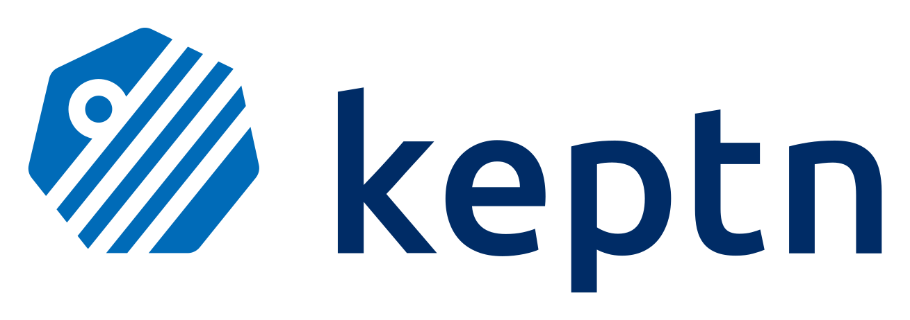

 

 
<h1>Keptn</h1>
<h3>
New Documentation Site Engine
 
Work Summary
</h3>

I have divided the Development Phase into two phases i.e. `Phase 1` and `Phase 2`.

> `Phase 1` will deal mostly with implementing core features and functionality needed in the documentation engine.

> `Phase 2` will deal mostly with implementing miscellaneous features and functionality of the documentation engine like Continuous Integration, Continuous Deployment, etc.

#### Phase 1

Subtask

> **Week 1 - Week 6 (June 13 - July 25, 2022)**

---

- [x] Initialization and deployment of the documentation engine based on Docusaurus from scratch.

  - [x] Initialised the new Docusaurus site using `npx create-docusaurus@latest new-keptn-docs-engine classic` command and push the changes to [keptn-sandbox/new-keptn-docs-engine](https://github.com/keptn-sandbox/new-keptn-docs-engine).

    > Above task is done and I have pushed the changes directly to the repository. Commit can be found here [https://github.com/keptn-sandbox/new-keptn-docs-engine/commit/e2f2202b01894806e1d9e924d97abb2b98b2d8d1](https://github.com/keptn-sandbox/new-keptn-docs-engine/commit/e2f2202b01894806e1d9e924d97abb2b98b2d8d1).

  - [x] Adding as basic documentation on how to use Docusaurus and what configuration of Docusaurus we are following like Project structure, Templates, etc.

    > I used the `npx create-docusaurus@latest new-keptn-docs-engine classic` command to create the new Docusaurus site so in this case, I used the `classic` template. Docusaurus recommend the `classic` template so that we can get started quickly, and it contains features found in Docusaurus 1. The `classic` template contains `@docusaurus/preset-classic` which includes standard documentation, a blog, custom pages, and a CSS framework (with dark mode support). We can get up and running extremely quickly with the classic template and customize things later on when you have gained more familiarity with Docusaurus. We can also use the template's TypeScript variant by passing the `--typescript` flag. See [TypeScript support](https://docusaurus.io/docs/typescript-support) for more information.

  - [x] Deploying the new Docusaurus site engine to Netlify.

    > [https://github.com/keptn-sandbox/new-keptn-docs-engine](https://github.com/keptn-sandbox/new-keptn-docs-engine) has been deployed to Netlify at [https://keptn-experimental-docs-site.netlify.app/](https://keptn-experimental-docs-site.netlify.app/).

  - [x] Adding `CONTRIBUTING.md` file with content related to how to add contents in Docusaurus and how to use it concerning Keptn. Also, this work will go on since we will be adding more content in the future according to documentation needs.

    > PR related to adding `CONTRIBUTING.md` file is [https://github.com/keptn-sandbox/new-keptn-docs-engine/pull/4](https://github.com/keptn-sandbox/new-keptn-docs-engine/pull/4).

---

- [x] Adding UI and UX changes and moving the content to the new documentation engine

  - [x] Implementing UI and UX changes in the documentation engine like creating components, templates, standalone pages, etc.

    > Created the new components, templates, standalone pages, etc for the documentation engine. I had refactored the default components and templates of the Docusaurus site which were added when the Docusaurus site was initialized.

    > Above task is done and I have pushed the changes directly to the repository. Commit can be found here [https://github.com/keptn-sandbox/new-keptn-docs-engine/commit/b749bbdfebfeaa41c789cd4c91ac29032ac1bbfa](https://github.com/keptn-sandbox/new-keptn-docs-engine/commit/b749bbdfebfeaa41c789cd4c91ac29032ac1bbfa).

    > After getting feedback from mentors on the new documentation engine, I have refactored the documentation engine. PR can be found here [https://github.com/keptn-sandbox/new-keptn-docs-engine/pull/9](https://github.com/keptn-sandbox/new-keptn-docs-engine/pull/9).

  - [x] Finalizing the things that need to be copied from the current documentation engine to the new documentation engine with proper structure.

  - [x] Copying content from the current documentation engine to the new documentation engine which has been finalized.

    > As of now not all contents are copied from the current documentation engine to the new documentation engine instead, some documents are copied to the new documentation engine.

  - [x] Adding documentation search functionality.

  > As of now I have added local search support using a [@easyops-cn/docusaurus-search-local](https://github.com/easyops-cn/docusaurus-search-local) local search plugin but in the future, we can update this to [Algolia DocSearch](https://docsearch.algolia.com/).

---

- [ ] Adding Versioning of docs support feature.

---

- [ ] Adding Multiple repository docs support feature.

---

- [ ] Implementing all SEO approaches listed in [https://docusaurus.io/docs/seo](https://docusaurus.io/docs/seo) like adding metadata in site configuration, adding metadata for all single pages, adding metadata in the front matter of all markdown files, etc.

- [ ] Adding internationalization ([i18n](https://en.wikipedia.org/wiki/Internationalization_and_localization)) support. A possible translation strategy is to version control the translation files with Git (or any other VCS).

  > Discussion on this is done [here](https://keptn.slack.com/archives/C017T4KUAG3/p1657235519862879) and we have put this on lower priority.

---

#### Phase 2

> **Week 7 - Week 12 (July 26 - September 5, 2022)**
